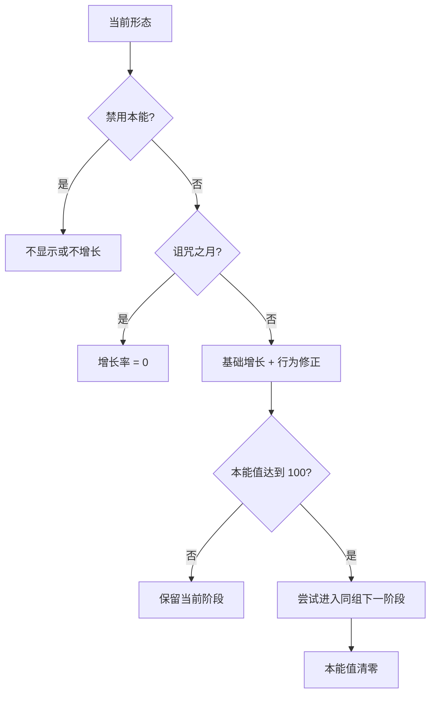

# 本能值

本能值（Instinct）是常规形态的长期阶段推进机制。它从 `0` 开始，达到 `100` 时尝试将玩家变为同一形态组的下一阶段，随后清零。

## 基础增长

普通可推进形态的基础增长率为：

$$
r_0=\frac{100}{9000\times20}\approx 0.0005556\text{ / tick}
$$

在没有任何加速或抵消效果的理想条件下，从 0 增至 100 约需 9,000 秒，即 **150 分钟**。这是源码常量推导值，不代表实际游戏一定需要这么久：环境、进食和行为会叠加正负修正。

本能值的理想增长可以写成：

$$
I(t)=\min\left(100,\;I_0+\sum_{k=1}^{t}(r_0+r_k)\right),\qquad r_0=\frac{100}{9000\times20}
$$

其中 $I_0$ 是开始计算时的本能值，$t$ 是经过的游戏 tick 数，$r_0$ 是每 tick 的基础增长，$r_k$ 是第 $k$ 个 tick 的环境或行为修正。诅咒之月期间，增长率直接变为 $0$。

## 什么会影响增长

各形态通过能力 JSON 添加“持续修正”或“即时修正”。例如：

| 形态线 | 已确认的倾向行为 |
| --- | --- |
| 蝙蝠 | 待在暗处、溶洞或滴水石附近，在空中活动，食用水果 |
| 美西螈 | 待在水中或繁茂洞穴、靠近垂滴叶，攻击鱼、食用鱼类 |
| 豹猫 | 待在丛林或树叶上，裸爪攻击、狩猎牲畜、食用生肉 |
| 使魔狐 | 待在针叶林、浆果丛或雪上移动，食用浆果，观察女巫或唤魔者 |
| 雪狐 | 冲刺跳跃；其他倾向以形态页和手册为准 |
| 阿努比斯之狼 | 待在沙漠、食用腐肉、承受凋零效果 |
| 蜘蛛 | 使用结露蛛网和茧阶段的专用流程，不应套用普通阶段路线 |

手册中的“本能”文字是玩家提示；真正改变数值的是形态加载的能力及其条件。整合包若覆盖 Origin JSON，也可能改变这些规则。

## 暂停、锁定与禁用

- 诅咒之月进行时，全服玩家的本能增长率暂时设为 `0`；即时本能修正也不会生效；
- 形态具有 `LockInstinct` 时，本能条保留但基础增长被锁定；
- 形态具有 `NoInstinct` 时，本能系统被禁用，通常也不会显示本能条；
- 部分动作可以给予负修正，但最终数值不会低于 `0`；
- 数值到达 `100` 后，如果找不到合法的下一形态，仍会清空本能值。

第 3 阶段常用于锁定普通本能推进，最终阶段需要共鸣催化剂等专门条件。蜘蛛茧和特殊形态另有自己的变身规则。

## HUD 怎么读

本能条显示范围为 $0\le I\le100$，并根据当前净增长率使用不同状态。数值达到 $80$、但尚未接近 $100$ 时，客户端会在玩家附近显示附魔粒子，提示变化正在逼近。

HUD 位置可在客户端配置中调整；本能值和增长率由服务端保存并同步，重登不等于重置。

:::note 数值口径
能力 JSON 的 `value` 是每次或每 tick 写入系统的原始修正，不能直接当成“每秒百分比”。持续时间、触发类型和服务器 tick 都会影响最终速度。
:::

来源：SSC `InstinctUtils.java`、`StaticParams.java`、`FormUtils.java`、各形态 Origin 与 instinct power JSON，commit `c0f0bbb9`。状态：`verified`（系统规则）；完整行为数值表：`partial`。
