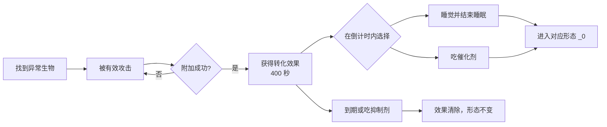

# 第一次变身

第一次变身不需要等待诅咒之月。正常流程是：找到带有附魔粒子的异常生物，让它攻击并取得对应的转化效果，再在效果消失前睡觉。[^source]

## 1. 确认模组已经启用

玩家首次进入安装了 SSC 的世界后，模组会延迟约 2 秒给予一本 **Book of Shape Shifter（变形者手册）**。右键打开手册，可以查看当前形态、外观、能力和本能提示。

如果没有收到手册：

- 先确认安装版本和依赖是否符合[安装与依赖](installation)；
- 已有存档或数据异常时，可用 1 个未加工月之尘和 1 本书重新合成；
- 服务端管理员应先查看日志，不要直接清除玩家形态数据。

## 2. 寻找异常生物

SSC 1.10.0 注册了五种带有附魔粒子的转化生物。它们都有独立的实体类型和生成条件：

| 异常生物   | 主要生成位置             | 命中后指向的初始形态 | 每次命中的效果概率 |
| ---------- | ------------------------ | -------------------- | -----------------: |
| 咒文蝙蝠   | 主世界，沿用蝙蝠生成条件 | 蝙蝠                 |                50% |
| 咒文美西螈 | 繁茂洞穴的水中           | 美西螈               |                70% |
| 咒文豹猫   | 丛林、竹林               | 豹猫                 |                50% |
| 咒文豺狼灵 | 沙漠、沙漠神殿           | 阿努比斯之狼         |                50% |
| 咒文蜘蛛   | 废弃矿井                 | 蜘蛛                 |                50% |

表中的概率是实体成功伤害玩家后，尝试附加效果的概率；它不是生成概率。五类实体的生成成功率还有一层服务器配置，默认均为 `0.5`，详见[配置参考](../server/configuration)。

:::note 狐形态不是这条自然感染路径
当前源码中的咒文豺狼灵只给予阿努比斯之狼效果。使魔狐来自女巫投掷或掉落的使魔狐喷溅药水；把使魔狐药水与金粒继续酿造可得到雪狐药水。悦灵药水由基础月尘药水加入紫水晶碎片酿造，野猫药水加入鳕鱼桶酿造。这四条路线没有对应的自然感染实体。
:::

## 3. 取得转化效果

让异常生物成功攻击你。每次有效攻击按上表概率尝试附加效果，成功时会获得持续 **400 秒（6 分 40 秒）** 的转化效果，并解锁“似乎有些不对劲？”进度。

只有处于原始变形者形态的玩家会从这些实体取得效果。已经进入某条形态线时，反复挨打通常不会改换形态线。若先后接触不同异常生物，新效果可以覆盖旧的转化效果。

## 4. 激活效果

在效果倒计时结束前选择一种方式：

1. **睡觉**：进入床并结束睡眠后，SSC 激活效果并开始首变。持有效果时，模组允许玩家绕过通常的睡眠时间限制，因此不必等到夜晚。
2. **食用催化剂**：效果存在时吃下催化剂，会立即激活同一次首变。

睡觉触发首变不依赖诅咒之月。代码还明确保留了“无需检测诅咒之月状态”的处理，因此不要为了首变盲目等待特定月相。

## 5. 变身之后

首变会进入对应形态线的 `_0` 形态，也就是界面中的第 1 阶段。此后主要通过本能值和诅咒之月推进：

- 按手册列出的倾向行动会改变[本能值](../gameplay/instinct)；
- 本能值达到 100 时会尝试进入同组下一阶段；
- [诅咒之月](../gameplay/cursed-moon)也可能临时推进形态；
- 催化剂和抑制剂分别尝试前进、后退，但会受到当前形态标记限制；
- 五条自然感染路线与使魔狐、雪狐路线的第 4 阶段都免疫两种生存模式抑制剂；到达后只能用创造模式专用抑制剂或管理员命令恢复。

## 没有成功时

| 现象           | 优先检查                                                           |
| -------------- | ------------------------------------------------------------------ |
| 找不到异常生物 | 生物群系、难度、生成上限，以及服务端是否把对应生成概率设为 `0`     |
| 挨打后没有效果 | 单次附加并非必定成功；确认自己仍是原始变形者                       |
| 效果突然消失   | 400 秒已结束，或使用了抑制剂；牛奶能否清除请以目标整合包实测为准   |
| 睡觉没有变身   | 确认结束睡眠时效果仍在；多人服务器还要排查其他模组对睡眠事件的修改 |
| 变成了意外形态 | 检查此前已有的效果、管理员命令、数据包动态形态和附属模组           |

[^source]: 源码核对：SSC `give_book`/`delay_give_book` 函数、`TransformativeEntitySpawning.java`、`ITMob.java`、`EffectManager.java`、`TransformativeStatusInstance.java`，commit `c0f0bbb9`。生成密度与跨模组睡眠兼容性尚未覆盖所有环境。
