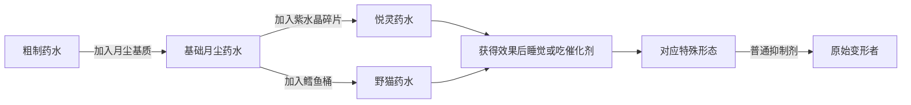

# 悦灵与野猫

悦灵和野猫各自只有一个幻形者诅咒形态，没有本能阶段，也不会受诅咒之月推进。两者都属于可恢复的特殊形态：喝普通抑制剂即可回到原始变形者。它们也是幻形者诅咒扩展包悦灵与野猫两组终局分支的起点。[^source]

## 如何进入

先在酿造台用粗制药水加入月尘基质，得到基础月尘药水。基础月尘药水加入紫水晶碎片会变成悦灵药水；加入鳕鱼桶会变成野猫药水。取得转化效果后睡觉或食用催化剂，即可完成变身。

## 悦灵

悦灵是低生命、远程支援形态。基础 20 点生命会减少 10 点，只剩 5 颗心；投射物伤害固定增加 6 点。单次攻击造成至少 4 点伤害时，自身恢复 2 点生命，内部冷却 10 tick，也就是 0.5 秒。20 格内的生物会以浅蓝轮廓显示。

按住跳跃键可以上升，单次最多持续 80 tick，也就是 4 秒；飞行时移动速度提高 16%，每 5 tick 增加 1.333 点饥饿消耗。使用挖掘等级高于石质的主手工具攻击时，总伤害降低 33%；硬度至少为 1 的方块挖掘速度降低 45%。腿甲与靴子无法穿戴，普通食物也无法食用，紫水晶碎片和模组允许的特殊食物例外。

距离正在播放唱片的唱片机不超过 3 格时，每 40 tick，也就是每 2 秒恢复 2 点生命。悦灵可以走过细雪，并拥有缓降与落地免疫。

### 交互模型

<!-- prettier-ignore-start -->
<FormModelViewer
  model="/models/forms/shape-shifter-curse/allay_sp/allay_sp.gltf"
  title="SP 悦灵 · allay_sp.gltf"
  animations={{
    'allay_sp_attack_1.0': '攻击',
    'allay_sp_digging_1.0': '挖掘',
    'allay_sp_fly_1.0': '飞行',
    'allay_sp_idle_1.0': '待机',
    'allay_sp_moving_1.0': '移动',
    'allay_sp_run_1.0': '奔跑',
    'allay_sp_sneaking_1.0': '潜行待机',
    'allay_sp_sneaking_walk_1.0': '潜行移动',
  }}
/>
<!-- prettier-ignore-end -->

## 野猫

<!-- prettier-ignore-start -->
<FormModelViewer
  model="/models/forms/shape-shifter-curse/feral_cat/feral_cat.gltf"
  title="野猫 · feral_cat.gltf"
  animations={{
    'form_feral_common_attack_1.0': '攻击',
    'form_feral_common_climb_1.0': '攀爬',
    'form_feral_common_climb_idle_1.0': '攀爬待机',
    'form_feral_common_dig_1.0': '挖掘',
    'form_feral_common_elytra_fly_1.0': '鞘翅飞行',
    'form_feral_common_fall_1.0': '下落',
    'form_feral_common_float_1.0': '漂浮',
    'form_feral_common_idle_1.0': '待机',
    'form_feral_common_jump_1.0': '跳跃',
    'form_feral_common_run_2.3': '奔跑',
    'form_feral_common_sleep_1.0': '睡眠',
    'form_feral_common_sneak_idle_1.0': '潜行待机',
    'form_feral_common_sneak_walk_1.0': '潜行移动',
    'form_feral_common_swim_1.0': '游泳',
    'form_feral_common_walk_1.2': '走动',
    'feral_cat_sp_riding_1.0': '骑乘',
  }}
/>
<!-- prettier-ignore-end -->

野猫是四足潜行形态，沿用豹猫终局形态的主要移动能力。它可以全向攀爬，免疫摔落，脚步无声且不会触发绊线，苦力怕会主动远离；猫与豹猫把玩家视为友好目标。它还有猫科夜视和四足视角摆动。

野猫无法穿戴腿甲与靴子。它没有本能条和后续幻形者诅咒阶段，普通抑制剂会直接结束形态。安装 Tough As Nails 时，野猫额外获得轻度寒冷抗性与脏水口渴保护；未安装该模组时，这两项兼容能力不会产生原版温度机制。

## 进入幻形者诅咒扩展包分支

安装幻形者诅咒扩展包后，悦灵和野猫都有两条终局分支。全部目标集中列在 [幻形者诅咒扩展包形态目录](../../../addons/shape-shifter-curse-addon/forms/overview)，进化道具、月相条件和失败后果见 [进化系统](../../../addons/shape-shifter-curse-addon/systems/evolution)。

[^source]: 获取与恢复规则参考 [幻形者诅咒官方 Form Types](https://ssc-wiki.readthedocs.io/en/latest/mod_content/form_types/) 并经 `RegCustomPotions.java`、`RegPlayerForms.java`、`form_allay_sp.json`、`form_feral_cat_sp.json` 与对应 power JSON 核对，commit `c0f0bbb9`。正文为重新归纳的中文说明。
