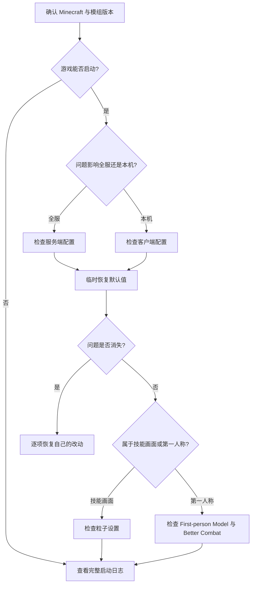

# 配置与兼容性

本页对应 SSC commit `c0f0bbb9` 和 SSCA commit `d84a18ca`。设置前先判断自己遇到的是哪一类问题：世界规则由服务器决定，界面位置和按键只影响本机，技能伤害与范围目前大多写在技能本身。[^source]

## 配置入口

安装 Mod Menu 后，可以从模组列表进入 Cloth Config 界面。直接编辑文件时应先关闭游戏或服务器，修改前备份配置。

| 模组 | 配置名                       | 作用域                     |
| ---- | ---------------------------- | -------------------------- |
| SSC  | `shape-shifter-curse-common` | 双端/服务器规则            |
| SSC  | `shape-shifter-curse-client` | 本地显示和工具             |
| SSCA | `ssc_addon_server`           | 服务端权威规则             |
| SSCA | `ssc_addon_client`           | 本地 HUD、按键和颜色编辑器 |

## SSC 公共配置

### 异常生物出现频率

这五项控制符合地点条件的异常生物通过一次生成尝试的机会。数值只影响生成环节，对感染成功率没有影响。填 `0` 会关闭对应生物的自然生成，填 `1` 会让每次合法尝试都通过。

| 生物       | 默认机会 | 适合调整的情况             | 查找字段                           |
| ---------- | -------: | -------------------------- | ---------------------------------- |
| 咒文蝙蝠   |      50% | 地下太难遇到时提高         | `transformativeBatSpawnChance`     |
| 咒文美西螈 |      50% | 繁茂洞穴路线太难开始时提高 | `transformativeAxolotlSpawnChance` |
| 咒文豹猫   |      50% | 想更快开始豹猫路线时提高   | `transformativeOcelotSpawnChance`  |
| 咒文豺狼灵 |      50% | 沙漠路线太稀少时提高       | `transformativeWolfSpawnChance`    |
| 咒文蜘蛛   |      50% | 废弃矿井路线太稀少时提高   | `transformativeSpiderSpawnChance`  |

### 诅咒之月和新玩家流程

| 想改变的体验               | 默认行为     | 修改后会发生什么                   | 查找字段                    |
| -------------------------- | ------------ | ---------------------------------- | --------------------------- |
| 哪些月相会进入诅咒之月     | 第 2、6 月相 | 换成自己的月相编号，夜间判定仍保留 | `curseMoonPhase`            |
| 月夜能否睡觉               | 不能         | 允许睡觉，月夜推进仍会照常处理     | `allowSleepInCursedMoon`    |
| 月夜是否推进形态           | 推进         | 关闭后不再自动前进                 | `enableCursedMoonTransform` |
| 普通玩家能否使用调试命令   | 不能         | 开放后可用部分调试入口，适合测试服 | `enableDebugCommand`        |
| 食物习惯                   | 开启         | 关闭后形态食物倾向不再改变食物效果 | `enableFoodHabitSystem`     |
| 是否跳过变身演出           | 不跳过       | 立即完成变身，适合测试             | `immediatelyTransform`      |
| 新玩家是否直接抽取初始形态 | 关闭         | 开启后按候选表选择初始形态         | `enableInitialForm`         |
| 药水能否提前感染未启用玩家 | 关闭         | 开启后相关药水可提前生效           | `statusPotionWithCurse`     |
| 女巫能否投掷提前感染药水   | 关闭         | 开启后女巫也能触发提前感染         | `witchPotionForPreBook`     |

`initialFormIds` 只在开启初始形态选择后读取，格式为 `命名空间:形态ID:权重`。普通玩家通常不需要改它；数据包作者才会用到。

:::warning `enableInitialForm` 默认值
源码注释写着 `Default: true`，但字段实际初始化为 `false`。本站以运行代码的字段值为准；这是旧文档或配置界面最容易写错的地方之一。
:::

### 已废弃 Patron 配置

`enablePatronFormSystem`、各类 Data/Resource Pack URL、Patron Data URL 和检查间隔仍留在配置类中，但源码已标为 `[Obsolete]`。新服务器不应围绕这些字段建立部署方案。

## SSC 客户端配置

这些设置只改变自己的画面和操作体验，联机时也不会替其他玩家修改。

| 想改变的画面或操作             | 默认体验       | 调整后的用途                          | 查找字段                                       |
| ------------------------------ | -------------- | ------------------------------------- | ---------------------------------------------- |
| 第一人称能否看到形态模型       | 显示           | 关闭后保留原版第一人称视角            | `enableFormModelOnVanillaFirstPersonRender`    |
| 形态要求隐藏手臂时是否照常显示 | 隐藏           | 开启后强制忽略隐藏手臂能力            | `ignoreNoRenderArmPower`                       |
| 眨眼间隔                       | 3–7 秒随机一次 | 最短和最长时间可分别调整              | `minBlinkIntervalTick`、`maxBlinkIntervalTick` |
| 每次眨眼时长                   | 0.2 秒         | 数值越高，闭眼画面停留越久            | `blinkTick`                                    |
| 起始书尺寸                     | 标准大小       | 开启后放大至 2 倍，适合高分辨率小界面 | `newStartBookForBiggerScreen`                  |
| First-person Model 联动        | 自动调整       | 关闭后由玩家自己维护兼容设置          | `enableChangeFPMConfig`                        |
| Better Combat 兼容修复         | 开启           | 发生特定整合包冲突时可关闭测试        | `enableBetterCombatFix`                        |

颜色选择菜单还带有旧版界面、跳过解锁检查、临时解锁全部形态和清除解锁记录等维护工具。普通游玩保持默认值即可；清除记录会直接改变本机保存的外观解锁状态。

### HUD 位置

Instinct、Mana 和物品存储条使用 1–9 九宫格锚点加 X/Y 偏移。默认锚点均为 `8`：

| HUD      |      X |     Y |
| -------- | -----: | ----: |
| Instinct |  `100` |  `-9` |
| Mana     |  `100` | `-17` |
| 物品存储 | `-120` |   `1` |

客户端配置还保留 Patron 授权文件 URL 和自定义 UUID 字段。它们不应被理解为服务器权限配置。

## SSCA 服务端配置

当前生效的服务端设置集中在三种体验上。

| 服主想控制的内容       | 默认体验     | 改动后的影响                                                       | 查找字段           |
| ---------------------- | ------------ | ------------------------------------------------------------------ | ------------------ |
| 技能是否保护队友       | 开启保护     | 关闭后攻击技能可以波及玩家、宠物和召唤物；增益技能仍会避开敌对生物 | `whitelistEnabled` |
| 战利品箱中故事书的语言 | 中文         | 可改成英文，已生成的书不会跟随变化                                 | `bookLanguage`     |
| 全服停用某项技能       | 空，全部开放 | 填入技能 ID 后，相关形态失去对应能力                               | `disabledSkills`   |

:::danger 不要使用旧的平衡参数表
SSCA 服务端配置类明确说明：雪狐、悦灵、阿努比斯狼和物品的旧平衡参数从未被代码读取，现已移除。源码中仅有私有旧结构作为说明，实际数值仍在能力 JSON 或 Java 类中。旧 Wiki 若声称可以通过这些配置改变伤害、范围或冷却，应视为过时。
:::

## SSCA 客户端配置

| 想改变的操作             | 默认体验       | 可选效果                               | 查找字段                 |
| ------------------------ | -------------- | -------------------------------------- | ------------------------ |
| 是否显示技能冷却条       | 显示           | 关闭后隐藏整条冷却界面                 | `showCdBar`              |
| 冷却条是否显示秒数       | 显示           | 关闭后只看进度长度                     | `showCdSeconds`          |
| 契灵瞬移落点             | 朝准星方向选择 | 平台模式会按另一套落点规则寻找位置     | `mancianimaTeleportMode` |
| 是否启用 SSCA 外观编辑器 | 关闭           | 开启后可使用颜色编辑和 20 个本地预设槽 | `enableColorEditor`      |

冷却条默认以锚点 `8`、主条偏移 `(-98, -21)`、副条偏移 `(98, -21)` 左右对称显示。位置由可视化编辑界面维护，不直接暴露在普通 AutoConfig 页面。

SSCA 还按形态保存特殊键位配置。启用后，该形态的主/副技能不再同步 SSC 的通用技能键，而使用玩家指定按键。

## 排障顺序

[^source]: 源码核对：SSC `CommonConfig.java`、`ClientConfig.java`；SSCA `SSCAddonServerConfig.java`、`SSCAddonClientConfig.java`。
