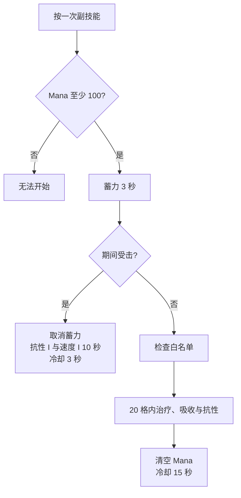

# SP 悦灵

SP 悦灵是 SSCA 的团队辅助形态。它的价值集中在范围治疗、净化药效、音乐增益和友军保护，输出能力相对有限，装备腿甲和鞋也会受到形态限制。[^source]

## 资源

SP 悦灵拥有独立 Mana 条，上限 200。平时每 8 tick 恢复 3 点，约等于每秒恢复 7.5 点；技能或便携信标会暂停、消耗这项资源。

| 资源     |   上限 | 主要用途                             |
| -------- | -----: | ------------------------------------ |
| Mana     |    200 | 群体治疗的启动门槛为 100，完成后清空 |
| 群疗蓄力 |   3 秒 | 决定是否完成群体治疗                 |
| 净化蓄力 | 1.5 秒 | 决定是否完成范围净化                 |

## 主技能：净化

按一次主技能开始蓄力，再按一次可以取消。蓄力 1.5 秒后，技能会清除自己和半径 20 格内目标的药水效果，并打断部分其他 SP 主动能力。蓄力时移动速度约降低 60%，成功释放后进入 20 秒冷却，Mana 自然回复暂停 3.5 秒。

净化适合处理团队成员身上的凋零、缓慢、挖掘疲劳等状态，也会影响范围内的敌对目标。使用前确认友军白名单，避免把保护逻辑理解成自动识别队友。

## 副技能：群体治疗

按一次副技能开始蓄力，再按一次可以取消。拥有至少 100 Mana 才能开始；持续 3 秒后，技能治疗 20 格球形范围内的有效目标。治疗量为目标最大生命值的 75%，附带相当于最大生命值 50% 的吸收生命，并给予 10 秒抗性 I。技能完成后清空 Mana，进入 300 tick（15 秒）冷却。

范围内没有其他可治疗玩家时，自己额外获得 20 秒力量 II、抗性 II，并让远程伤害提高 30%。团队使用时，治疗和强化会按照白名单决定目标。

| 参数             |                 数值 |
| ---------------- | -------------------: |
| 作用半径         |                20 格 |
| 蓄力时间         |                 3 秒 |
| 治疗量           | 目标最大生命值的 75% |
| 吸收量           | 目标最大生命值的 50% |
| 吸收持续时间     |                30 秒 |
| 团队抗性         |        抗性 I，10 秒 |
| 单人强化持续时间 |                20 秒 |
| 单人远程增伤     |           30%，20 秒 |
| 成功冷却         |                15 秒 |
| 受击中断冷却     |                 3 秒 |
| Mana 消耗        |        当前全部 Mana |

## 音乐与信标

唱片机增益范围为 20 格，音乐状态会每 tick 刷新短时效果，所以玩家离开范围后效果会自然停止。便携信标同样围绕 20 格范围工作，并能参与 Mana 回复；具体增益取决于当前装备和启用的能力节点。

## 保护自己和队伍

默认空白名单会保护所有玩家、已驯服宠物和带主人标记的召唤物。加入第一名玩家或生物后，系统切换为仅保护名单内目标。完整行为和修改方法见[操作、HUD 与白名单](controls-and-safety)。

:::warning 操作方式
两个技能都采用“按一次开始、再按一次取消”。持续按住不会加快蓄力。建议开启冷却秒数显示，便于区分 Mana 不足、蓄力中和冷却中三种状态。
:::

:::note 数值冲突
群疗能力 JSON 底部仍保留“20 点治疗、30 秒冷却”的旧描述，英文语言文件也写着 30 秒；实际执行分支使用最大生命值的 75% 和 300 tick（15 秒）。本页采用执行代码，中文语言文件已与它一致。
:::

[^source]: 源码核对：SSCA `AllaySPGroupHeal.java`、`AllaySPJukebox.java`、`AllaySPPortableBeacon.java`、`form_allay_sp_group_heal.json` 与 `form_allay_sp_purify.json`，commit `d84a18ca`。
