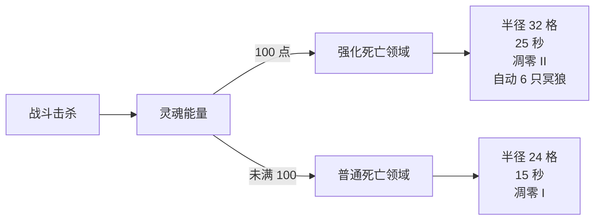

# 冥裁者

冥裁者是阿努比斯之狼的 SSCA 终局形态。它把战斗分成两段：先用普通击杀积攒灵魂能量，再用死亡领域把积攒的能量转成更强的区域控制。

## 进入方式

从 `shape-shifter-curse:anubis_wolf_3` 使用月髓十字环，可在诅咒之月夜晚进入 `my_addon:anubis_wolf_sp`。使用进化石会进入同一形态；当前形态已经是 SSCA 映射目标时再次使用月髓环，会触发致命共振，详见[进化系统](evolution)。

## 资源和被动

| 项目 | 数值或条件 | 实际影响 |
| --- | --- | --- |
| 灵魂能量上限 | 100 | 用于强化死亡领域 |
| 领域内击杀 | +20 | 最快的积攒方式 |
| 冥狼击杀 | +10 | 召唤物完成击杀时获得 |
| 普通击杀 | +5 | 不在领域中也能积累 |
| 自身处于凋零时击杀 | 额外 +10 | 叠加在对应击杀奖励上 |
| 灵魂沙/灵魂土 | 持续恢复生命 | 适合把战场固定在下界主题地形 |
| 亡灵生物 | 默认中立 | 先攻击后会进入敌对状态，停止攻击约 30 秒后恢复 |

## 主技能：死亡领域

主技能键按住后进入蓄力，松开释放。普通释放需要 40 tick，也就是 2 秒；成功后领域半径 24 格、高度 9 格，持续 300 tick，也就是 15 秒。冷却为 1000 tick，即 50 秒。

领域中的敌对生物会受到缓慢 I、凋零 I，并失去 15% 最大生命值。领域中心固定在释放完成的位置，移动到远处不会拖着领域走。

当灵魂能量达到 100，下一次领域会进入强化版本：蓄力缩短到 20 tick（1 秒），半径扩大到 32 格，持续 500 tick（25 秒），凋零提升为 II，并自动召唤 6 只冥狼。强化领域会消耗全部 100 点灵魂能量。

## 副技能：召唤冥狼

副技能先嚎叫 30 tick（1.5 秒），随后召唤 2 只持续 600 tick（30 秒）的冥狼。普通冷却为 600 tick（30 秒），同时存在的基础上限为 6 只；领域内召唤会提高数量，强化领域还会自动追加冥狼。

蓄力期间玩家移动速度只保留 50%。没有可用的召唤空间时会进入 100 tick（5 秒）惩罚冷却。冥狼攻击带有凋零效果，攻击已经处于凋零状态的目标时会治疗主人。

## 战斗建议

先在安全位置用普通攻击和领域内击杀把能量推到 100，再释放强化领域。领域的 15% 最大生命值削减适合对付高生命目标；面对会迅速离开区域的敌人，先用冥狼和凋零减速建立控制，再开始蓄力。

:::note 版本口径
上述范围、时间、数量和能量数值来自 SSCA Java 常量。饰品可以改变冥狼属性和数量，不能据此推断所有整合包中结果完全一致。
:::

来源：SSCA `AnubisWolfSpDeathDomain.java`、`AnubisWolfSpSummonWolves.java`、`AnubisWolfSpSoulEnergy.java` 与 `form_anubis_wolf_sp.json`，commit `d84a18ca`。状态：`verified`。
