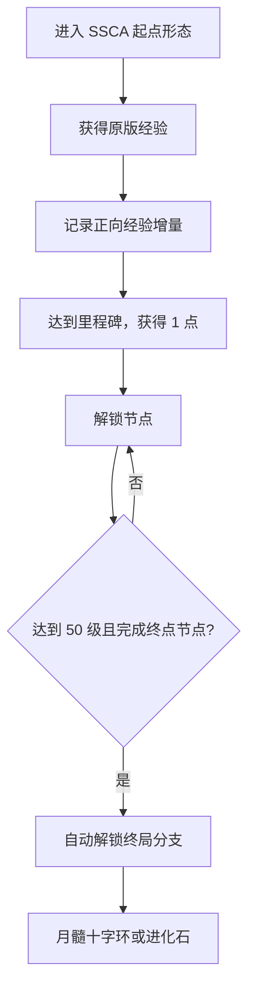
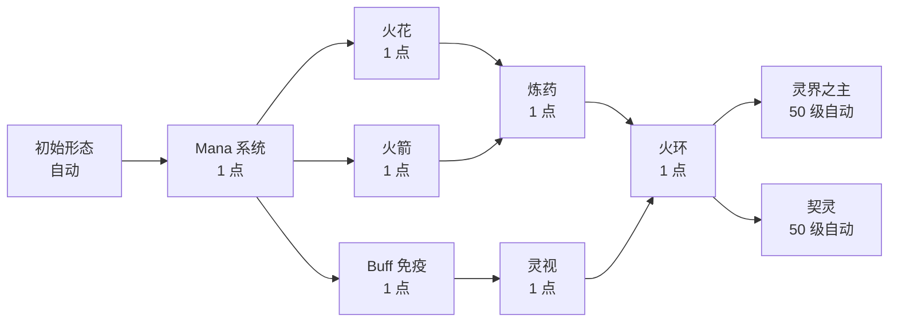
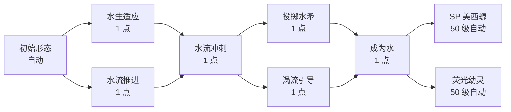

import {EvolutionExperienceChart} from '@site/src/components/SystemCharts';

# 进化系统[^source]

SSCA 把“进化”用于三套有关联、但规则不同的机制：加点路线负责成长，月髓十字环和进化石负责终局分支。先确认手中道具和当前形态，再决定路线。



## 加点路线

新玩家可以从 SSC 起始手册选择进化使魔或进化美西螈。进入对应形态后，打开变形者手册，点击“进化加点”即可查看技能树。服务端会自动解锁初始形态节点；通过命令进入这两个起点形态时也会建立对应路线。

| 起点 | 形态 | 可花费点数 | 拿齐点数的等级 | 终局分支出现等级 |
| --- | --- | ---: | ---: | ---: |
| 进化使魔 | `my_addon:upgrade_familiar_fox` | 7 | 45 | 50 |
| 进化美西螈 | `my_addon:upgrade_axolotl` | 6 | 40 | 50 |

### 经验和点数

进化经验只记录进入路线后新获得的原版总经验正增量。附魔、铁砧消费或死亡造成的经验减少不会倒扣进化经验。系统先把累计获得的原版经验除以 2 并向下取整，再按原版经验曲线换算为进化等级，上限 50 级。也就是说，进化等级 50 需要在进入路线后累计获得 10,690 点原版经验。

<EvolutionExperienceChart />

| 路线 | 发放加点点数的等级里程碑 | 满级自动分支 |
| --- | --- | ---: |
| 进化使魔 | 5、10、15、20、30、40、45 | 50 |
| 进化美西螈 | 5、10、15、20、30、40 | 50 |

每跨过一个里程碑发放 1 点。普通节点各花费 1 点，初始节点与终局分支不花点。点击普通节点只会加入待确认区，点击“确认加点”后才生效。

### 进化使魔



火花、火箭和 Buff 免疫可以自行安排先后；炼药同时要求火花与火箭，火环又同时要求炼药与灵视。到达终点共需 7 点，最终会解锁全部普通节点。

| 节点 | 直接得到的能力 | 关键数值 |
| --- | --- | --- |
| Mana 系统 | 吸附生物能量、食性与 Mana 护盾 | 初始上限 33；脱战 5 秒后每秒恢复 1；Mana 高于一半时减伤 15% |
| 火花 | 近身范围火焰攻击 | 消耗 11 Mana；半径约 3 格；4 点伤害；点燃 5 秒；Mana 上限增加 10 |
| 火箭 | 箭矢火箭与符纸火球 | 符纸火球 9 点伤害；Mana 上限增加 10 |
| Buff 免疫 | 状态免疫、耗 Mana 的火焰与岩浆免疫 | Mana 上限增加 10；与炼药合计提供 50% 魔法减伤 |
| 炼药 | 制作治疗、伤害和毒药 | Mana 上限增加 10 |
| 灵视 | 令附近生物发光 | Mana 上限增加 10；自然回复速度提高 10% |
| 火环 | 取代火花的完整范围攻击 | 消耗 11 Mana；半径约 4 格；8 点伤害；点燃 10 秒；Mana 上限增加 20；自然回复速度提高 20% |

全部上限节点解锁后，Mana 上限从 33 增至 103。自然回复加成合计 30%，基础每秒 1 点因此变为每秒 1.3 点。

### 进化美西螈



水生适应与水流推进可以自行安排先后。水流冲刺要求两者都已解锁；成为水又要求水矛与涡流引导都已解锁。走到终点共需 6 点。

| 节点 | 直接得到的能力 | 关键数值 |
| --- | --- | --- |
| 初始形态 | 水下呼吸、肉食与湿润度系统 | 陆地湿润度消耗为正常值的 1.5 倍；耗尽后脱水受伤 |
| 水生适应 | 水下夜视、游泳加速、跃出水面 | 贴近水面时可以起跳离水 |
| 水流推进 | 陆地疾跑和疾跑跳跃强化 | 疾跑跳跃追加前冲 |
| 水流冲刺 | 水中或陆地冲刺 | 水中按疾跑免费触发；陆地疾跑时按潜行并消耗湿润度；冷却 5 秒 |
| 投掷水矛 | 主技能水矛 | 后跃约 3 格；蓄力 1.35 秒；直击 12 点物理伤害；2 格内追加 5 点；消耗 6% 湿润度；冷却 8 秒 |
| 涡流引导 | 副技能恢复 | 引导 3 秒；移速约降低 50%；共恢复 12 点生命；完成后获得 4 点吸收生命 30 秒；冷却 8 秒 |
| 成为水 | 降低陆地湿润度消耗 | 移除 1.5 倍额外消耗，回到正常速度 |

### 终局出口

终局出口亮起代表路线准备完成，玩家仍需使用对应物品完成变身。进化使魔使用月髓十字环进入灵界之主，使用进化石进入契灵；进化美西螈使用月髓十字环进入 SP 美西螈，使用进化石进入荧光幼灵。月髓十字环还要求当前处于诅咒之月夜晚。

离开当前路线的起点形态会清空路线、经验、点数和节点。正常终局变身会经过专门的分支检查；用其他模组或命令强行切换形态可能直接触发这项重置。

## 月髓十字环

月髓十字环 `ssc_addon:sp_upgrade_thing` 只有在**诅咒之月的夜晚**才能成功进化。它按照固定映射将 SSC 最终形态或进化路线起点变为对应 SSCA 形态，详见[形态目录](forms-catalog)。

### 配方

```text
金锭        绿宝石      金锭
红石        幻鳞核心    月尘水晶碎片
金锭        下界合金锭  金锭
```

物品也以总计 3% 的概率加入沉船补给/宝藏箱、古城、堡垒遗迹和末地城宝藏箱；触发后与进化石等权二选一。

### 失败后果

| 条件 | 结果 |
| --- | --- |
| 合法起点 + 诅咒之月夜晚 | 成功变身，非创造模式消耗物品 |
| 合法起点，但不是诅咒之月夜晚 | 不变身，无伤害，非创造模式仍消耗物品 |
| 错误形态 + 诅咒之月夜晚 | 受到 10 点诅咒侵蚀伤害，并获得 20 秒缓慢 II、虚弱 II、挖掘疲劳 II；消耗物品 |
| 已是映射中的 SP 目标 + 诅咒之月夜晚 | 产生强度 6 爆炸并承受致命伤害；消耗物品 |

:::danger 月髓环会在失败时消耗
不要用它试探当前月相或形态。尤其不要在诅咒之月中对已经进化的目标形态再次使用。
:::

## 进化石

进化石 `ssc_addon:evolution_stone` 不要求诅咒之月。长按使用完成后，只要当前形态存在目标映射，就直接开始进化；无目标时显示“未响应”，不消耗物品。

它是不可堆叠、抗火物品，配方为 2 个紫水晶碎片、2 个回响碎片、2 个钻石、1 个幻鳞核心、1 个月尘水晶碎片和 1 个下界合金锭的无序合成。它与月髓环共享上述结构宝箱的 3% 二选一掉落池。

进化石不会对任意形态随机选结果，它使用固定映射。例如 `bat_3` 只会指向寄生果蝠，`spider_3` 只会指向跳蛛。

## 灵能宝珠与转职

灵能宝珠 `ssc_addon:psionic_orb` 只对进化路线起点形态生效。长按后打开路线选择界面；确认转职时：

- 至少需要已经取得 3 个加点点数对应的里程碑进度；
- 消耗 1 个灵能宝珠；
- 进化等级倒退 3 个里程碑档；
- 新路线的技能树清空，从基础节点重新开始；
- 按倒退后的等级和新路线里程碑重新发放点数。

转职发生在进化使魔与进化美西螈等“路线起点形态”之间，需要支付资源和等级代价；两个终局 SP 形态不能借此自由切换。

## 管理与排障

`/ssc_addon evolution unlock_all [player]` 为目标玩家设置全解锁标记；`reset [player]` 会清空路线、进化经验、进化等级、剩余点数、已解锁节点、待确认节点和终局分支。测试前备份玩家数据。

若加点界面没有出现，依次检查当前形态是否为进化路线起点、客户端与服务端 SSCA 文件是否一致、route JSON 是否成功加载。若终局物品提示分支未解锁，达到 50 级还不够，还必须满足最终节点的全部前置。

[^source]: 路线名称参考 [SSCA 官方形态概述](https://shape-shifter-curse-addon.readthedocs.io/zh-cn/latest/sp_forms/overview/)，规则与数值经 `EvolutionComponent.java`、`EvolutionManager.java`、route JSON、`SpUpgradeItem.java`、`EvolutionStoneItem.java`、`PsionicOrbItem.java` 和 `EvolutionItemsLoot.java` 核对，commit `d84a18ca`。旧存档迁移仍需按发行包测试。
