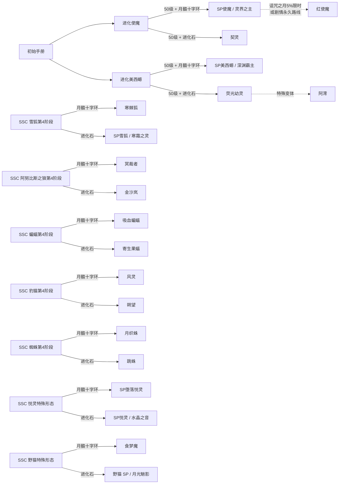

# SSCA 形态目录

当前基线共注册 22 个附属形态。它们都带有 `NoInstinct`、`NoCursedMoonEffect`、`SpecialForm` 和 `InhibitorImmune` 标记：不会走普通本能或诅咒之月阶段推进，也不能靠普通抑制剂恢复。[^source]

下面这张图覆盖当前代码注册的全部 22 个形态。蓝色路线从初始手册进入加点树；其余路线先到达 SSC 指定形态，再根据道具分流。月髓十字环路线还要求处于诅咒之月的夜晚。

## 使魔与美西螈进化路线

| 显示名     | 形态 ID                            | 定位或主要来源           |
| ---------- | ---------------------------------- | ------------------------ |
| 进化使魔   | `my_addon:upgrade_familiar_fox`    | 开局可选的加点路线起点   |
| SP 使魔    | `my_addon:familiar_fox_sp`         | 月髓环分支，也称灵界之主 |
| 契灵       | `my_addon:familiar_fox_mancianima` | 进化石分支               |
| 使魔 (Red) | `my_addon:familiar_fox_red`        | 剧情/特殊变体            |
| 进化美西螈 | `my_addon:upgrade_axolotl`         | 开局可选的加点路线起点   |
| SP 美西螈  | `my_addon:axolotl_sp`              | 月髓环分支               |
| 荧光幼灵   | `my_addon:axolotl_fluorescent`     | 进化石分支               |
| 阿澪       | `my_addon:axolotl_aling`           | 荧光幼灵的剧情/特殊变体  |

## 其他终局分支

| SSC 起点        | 月髓十字环目标                | 进化石目标                     |
| --------------- | ----------------------------- | ------------------------------ |
| `snow_fox_3`    | 寒棘狐 `snow_fox_frostspine`  | SP 雪狐 `snow_fox_sp`          |
| `anubis_wolf_3` | 冥裁者 `anubis_wolf_sp`       | 金沙岚 `golden_sandstorm_sp`   |
| `bat_3`         | 吸血蝙蝠 `bat_desmodus`       | 寄生果蝠 `bat_parasitic_fruit` |
| `ocelot_3`      | 风灵 `ocelot_wind_spirit`     | 朔望 `ocelot_nova`             |
| `spider_3`      | 月织蛛 `spider_moon_weaver`   | 跳蛛 `spider_salticidae`       |
| `allay_sp`      | SP 堕落悦灵 `fallen_allay_sp` | SP 悦灵 `allay_sp`             |
| `feral_cat_sp`  | 食梦魔 `wild_cat_nightmare`   | 野猫 (SP) `wild_cat_sp`        |

上表 SSCA 目标 ID 均使用 `my_addon:` 命名空间，表中为节省宽度省略了前缀；SSC 起点使用 `shape-shifter-curse:`。

## 22 个形态速查

下表把每个注册形态翻译成玩家能直接判断的战斗循环。数值优先采用 Java 常量和当前中文能力描述；带有“约”的项目仍会受目标属性、装备或距离影响。

| 形态        | 进入方式                 | 核心循环                                                  | 已确认数值                                                      |
| ----------- | ------------------------ | --------------------------------------------------------- | --------------------------------------------------------------- |
| 进化使魔    | 起始手册选路线           | 经验换点数，逐步解锁 Mana、火花、火箭、炼药、灵视和火环   | 7 个普通节点；45 级拿齐点数，50 级开终局出口                    |
| SP 使魔     | 进化路线 + 月髓环        | 苍蓝火环持续耗 Mana，击杀回 Mana，Mana 高于 50 时护盾减伤 | 护盾减伤 50%；火环用于持续范围压制，Mana 降到门槛后护盾停止生效 |
| 契灵        | 进化路线 + 进化石        | 瞄准建立黄/红烙印，斩杀补满抗伤与传送，村庄敲钟触发袭击   | 常驻 2 层抗伤；脱战 5 秒后每 15 秒恢复 1 层                     |
| 使魔 (Red)  | 特殊变体                 | 苍蓝火环与穿透狐火球，兼具爆炸和连锁伤害                  | 狐火球直击 8 点魔法伤害，碰撞爆炸 6 点，半径 6 格               |
| 进化美西螈  | 起始手册选路线           | 经验换点数，水生适应与水流技能汇合后进入终局分支          | 6 个普通节点；40 级拿齐点数，50 级开终局出口                    |
| SP 美西螈   | 进化路线 + 月髓环        | 水矛制作、涡流冲击、假死和湿润度管理                      | 涡流最长蓄力 4 秒；假死约恢复 15 点生命，期间减伤 60%           |
| 荧光幼灵    | 进化路线 + 进化石        | 潮汐牵引控制，蓄力法阵激光远距离输出                      | 激光蓄力 7 秒、射程 32 格、总计约 120 点魔法伤害；物理闪避 20%  |
| 阿澪        | 荧光幼灵特殊变体         | 延长潮汐牵引，三连发缩型激光，降低陆地湿润流失            | 每道激光 12 点物理伤害；潮汐时长与飞行距离约增加 20%            |
| 吸血蝙蝠    | `bat_3` + 月髓环         | 先用幽雾化形规避，再凝聚爆破；战斗维持血渴区间            | 血渴上限 100；爆破 12 点、冷却 10 秒；超声波 6 点、冷却 8 秒    |
| 寄生果蝠    | `bat_3` + 进化石         | 给友军结果支援果，给敌人结果削弱果；孢子弹扩散感染        | 种子上限 10；种子最多 3 层/目标；孢子感染 10 秒                 |
| 寒棘狐      | `snow_fox_3` + 月髓环    | 寒棘护体、冰面移动与冰锥爆发                              | 冰锥最多 5 根；每根约 1.2 秒凝聚                                |
| SP 雪狐     | `snow_fox_3` + 进化石    | 消耗霜寒进行近战、瞬移、冰球和冰风暴，受击触发护盾        | 霜寒上限 100；护盾消耗 20 并减免该次 50% 伤害                   |
| 冥裁者      | `anubis_wolf_3` + 月髓环 | 击杀蓄灵魂，死亡领域控制战场，满能量释放强化领域          | 灵魂上限 100；普通、冥狼、领域击杀分别增加 5、10、20            |
| 金沙岚      | `anubis_wolf_3` + 进化石 | 侵蚀烙印叠层后引爆，凋零金沙和受击反噬                    | 烙印最多 3 层；引爆造成目标当前生命值 20%，单次上限 20          |
| 风灵        | `ocelot_3` + 月髓环      | 左键连爪升速，空中标记落点后疾风冲刺                      | 冲刺最远 16 格；落点 3 格内造成 12 点物理伤害；冷却 12 秒       |
| 朔望        | `ocelot_3` + 进化石      | 灵跃叠闪避，舍身爆炸清场，九命负责承接致死伤害            | 命数上限 8；爆炸蓄力 5 秒，中心 50 点，冷却 30 秒               |
| 月织蛛      | `spider_3` + 月髓环      | 蛛丝蓄力铺网，蛛丝荡漾摆荡，蛛网内获得资源优势            | 蛛网亲和时移速提高 20%、每秒回 1 Mana、受伤减少 20%             |
| 跳蛛        | `spider_3` + 进化石      | 远距离跳杀、毒素与追踪，落地后继续攀爬追击                | 满蓄 3 秒，最远 16 格；跳杀 8 点物理伤害并中毒 II 8 秒          |
| SP 悦灵     | `allay_sp` + 进化石      | 净化、群疗、图腾和信标组成团队辅助循环                    | Mana 上限 200；群疗 75% 最大生命值治疗、50% 吸收生命            |
| SP 堕落悦灵 | `allay_sp` + 月髓环      | 标记目标后召唤恼鬼，暗影尖啸清理空中威胁                  | 恼鬼 2 只、存在 35 秒；尖啸蓄力 1 秒，冷却 20 秒                |
| 野猫 (SP)   | `feral_cat_sp` + 进化石  | 夜间隐身、震慑冲刺和墨囊致盲，靠生肉维持饱食              | 冲刺 5 格，震慑半径 5 格、1.5 秒；冷却 12 秒                    |
| 食梦魔      | `feral_cat_sp` + 月髓环  | 先累计伤害让目标入梦，再用恐惧和惊吓控制                  | 入梦门槛 10 点伤害；恐惧冷却 20 秒，诅咒之月为 14 秒            |

“月髓环/进化石”表示成功路线的标准入口。`allay_sp` 和 `feral_cat_sp` 本身已经是独立形态，使用对应道具时会依照 SSCA 固定映射处理；失败后果见[进化系统](evolution)。

[^source]: 名称参考 [SSCA 官方形态概述](https://shape-shifter-curse-addon.readthedocs.io/zh-cn/latest/sp_forms/overview/)，注册与路线另经 `SscAddonForms.java`、`FormIdentifiers.java`、`EvolutionStoneItem.java`、`SpUpgradeItem.java` 和 `zh_cn.json` 核对，commit `d84a18ca`。能力摘要只收录已能从执行代码确认的数值。
