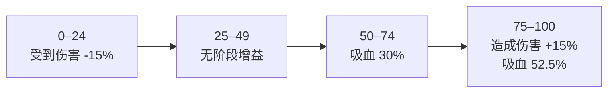

import {ResourceRecoveryChart} from '@site/src/components/SystemCharts';

# 数值系统[^source]

SSCA 的能力由数据包 JSON 与 Java 共同执行。玩家看到的技能文字有时没有随执行代码更新，因此本站先说明统一口径，再在形态页列出当前 commit 的实际常量。

## 生命和伤害

Minecraft 内部以生命点计算血量，2 点生命等于界面上的 1 颗心。文档中的“造成 8 点伤害”表示基础值相当于 4 颗心；护甲、附魔、抗性效果、伤害类型和目标自身减伤仍会改变结算结果。

| 文档写法 | 屏幕上的直观含义 |
| --- | --- |
| 恢复 6 点生命 | 恢复 3 颗红心 |
| 获得 12 点吸收生命 | 获得 6 颗黄心 |
| 目标最大生命值的 75% | 原版玩家上限为 20 时，对应 15 点或 7.5 颗心 |
| 真实伤害 | 技能直接使用指定伤害路径；仍以对应源码中的伤害类型和免疫检查为准 |

范围技能常见球形、圆柱形和轴对齐方盒三种判定。半径 20 格的球形技能会检查三维直线距离；高度 9 格、半径 24 格的圆柱领域会分别限制水平距离和上下高度；3×3×3 方盒覆盖施法者周围固定长宽高。相同“20 格”文字在不同形状下覆盖体积会明显不同。

## 时间

正常运行速度下，每秒有 20 个游戏 tick：

$$
t_{\mathrm{second}}=\frac{t_{\mathrm{tick}}}{20}
$$

| 源码数值 | 实际时间 |
| ---: | ---: |
| 6 tick | 0.3 秒 |
| 20 tick | 1 秒 |
| 60 tick | 3 秒 |
| 100 tick | 5 秒 |
| 300 tick | 15 秒 |
| 600 tick | 30 秒 |

服务器卡顿时，20 tick 可能花费超过现实中的 1 秒。技能仍按服务器 tick 推进，所以现实等待时间会跟着拉长。

## 资源条的共同规则

SSCA 统一管理 SP 悦灵 Mana、吸血蝙蝠血渴、冥裁者灵魂能量、SP 雪狐霜寒和寄生果蝠种子量。设当前值为 $R$、上限为 $M$、本次变化为 $\Delta R$，写入后的值为：

$$
R'=\min\left(M,\max\left(0,R+\Delta R\right)\right)
$$

回复超过上限的部分会消失。技能消耗采用“足够才扣”的规则：

$$
R'=\begin{cases}
R-C, & R\ge C\\
R, & R<C
\end{cases}
$$

其中 $C$ 为消耗。资源不足时，技能通常保持原值并拒绝执行；少数能力有单独的失败消耗，形态页会明确说明。

## 各形态资源

| 形态 | 资源与范围 | 开始值 | 主要恢复 | 主要用途 |
| --- | --- | ---: | --- | --- |
| SP 悦灵 | Mana，0 至 200 | 0 | 每 8 tick 恢复 3；远程命中每 3.5 秒可恢复上限的 8% | 群疗至少需要 100，完成后清空；信标与应急食物也会消耗 |
| 吸血蝙蝠 | 血渴，0 至 100 | 0 | 普攻命中增加 8，技能前三个目标依次增加 12、6、3，击杀增加 15 | 数值区间直接改变减伤、吸血和伤害 |
| 冥裁者 | 灵魂能量，0 至 100 | 0 | 普通击杀增加 5，冥狼击杀增加 10，领域内击杀增加 20，自身凋零时额外增加 10 | 满 100 强化下一次死亡领域并清空 |
| SP 雪狐 | 霜寒，0 至 100 | 0 | 技能或受伤后暂停 5 秒；随后每秒恢复 3，适宜温度环境恢复 5 | 近战主技能 15，瞬移成功 30、失败 20，冰风暴 30，护盾触发 20 |
| 寄生果蝠 | 种子量，0 至 10 | 10 | 脱战每 5 秒增加 1，交战每 8 秒增加 1；吃种子也可增加 1 | 灵果寄生与孢子弹每次消耗 1 |

### 血渴的四段效果

吸血蝙蝠进入战斗后停止自然衰减。最后一次攻击或受伤经过 12 秒后，每秒减少 4 点；露天夜晚减为每秒 2 点，露天白天增至每秒 6 点。饰品还能继续改变获得量与衰减速度。

### 资源回复速度比较

以下时间从空资源开始，只计算稳定自然回复，不包含击杀、命中、吃种子、环境切换与暂停时间。

<ResourceRecoveryChart />

## 独立计数系统

朔望的“九命”实际储存 8 次额外复活机会，初始值和上限均为 8。致死伤害消耗 1 次，恢复 6 点生命、获得 12 点吸收生命 30 秒，并获得 1 秒无敌；接下来的 3 秒内再次受到致死伤害会真正死亡。脱战 10 秒后，每 20 秒恢复 1 次，真正死亡并重生后回满。

美西螈路线用空气值承载湿润度。基础最大空气为 300 点，陆地上每秒减少 3 点，也就是每秒 1%；进化美西螈解锁“成为水”前还会每 2 秒额外减少 3 点，总速度为每秒 4.5 点。下雨、入水、能力与装备会改变这个过程。

技能冷却、蓄力和连击窗口属于临时计时器。它们经常与主资源并列存在，例如拥有足够 Mana 只代表资源门槛满足，冷却条仍可能阻止释放。HUD 中资源条表示“还能支付多少”，冷却条表示“何时允许再次使用”。

## 百分比如何叠加

同一能力中的加法、总乘区和最终倍率可能处于不同计算阶段。两个 20% 效果相加时得到 40%，连续相乘时为 $1.2\times1.2=1.44$。本站只在源码能确认运算位置时给出合并后的结果；单个效果仍按自身数值陈述。

[^source]: 源码核对：SSCA `ResourceBars.java`、`BarKeys.java`、各资源 power JSON、`BatDesmodusBloodThirst.java`、`ParasiticSeedEnergyRegen.java`、`NineLivesManager.java` 与相关技能类，commit `d84a18ca`。基础值已核对；饰品叠加与跨模组伤害链可能改变最终结果。
